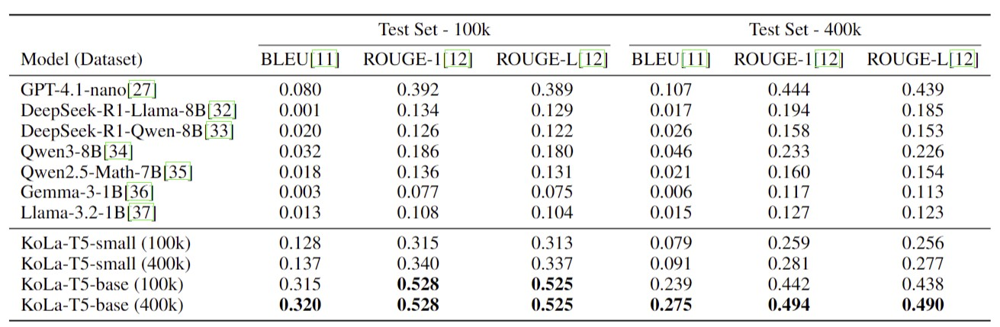

# KoLa: Korean speech to LaTeX extraction Using small LM Modules

📢 2025년 1학기 [AIKU](https://github.com/AIKU-Official) 활동으로 진행한 프로젝트입니다
🎉 2025년 1학기 AIKU Conference 열심히상 수상!

## 소개

Pipeline: KoLa는 한국어 수학 음성을 LaTeX 수식으로 직접 변환하기 위해 설계된 가볍고 모듈화된 파이프라인입니다!
Dataset Generation: 한국어 수학 음성, 텍스트 전사, 그리고 이에 대응하는 LaTeX 수식으로 이루어진 10만 개 규모의 병렬 데이터셋인 KoTeX-100K와 KoTeX-400K를 구축했습니다!

## 방법론

KoLa는 Whisper 기반의 음성 인식(ASR) 모듈을 사용합니다.
이후, 텍스트 기반 Error Corrector와 LaTeX Translator라는 두 개의 T5-base 기반 모듈이 순차적으로 동작합니다.
이 두 모듈은 KoTeX-100K와 KoTeX-400K 데이터셋을 기반으로 독립적으로 학습됩니다.
이를 통해, 음성 인식 오류를 효율적으로 보정하고 LaTex Translation 성능을 향상시켰습니다.
(SOTA또한 달성했습니다!!:) )

## 예시 결과

- 한국어 음성을 받고, 대응되는 LaTeX를 출력합니다.

- 예시 input: 에이제곱 더하기 비제곱
- 예시 output:
$$
\frac{a^2 + b^2}
$$

## 팀원

- [김민준](ddomjun): build, train, test KoLa model pipeline code
- [전혜서](doupari): data generation, data pre-/post-processing, evaluation on other LLM models
- [김태관](TTKKWAN): build, train, test KoLa model pipeline code
- [윤승현](xiseren): data generation, data pre-/post-processing
