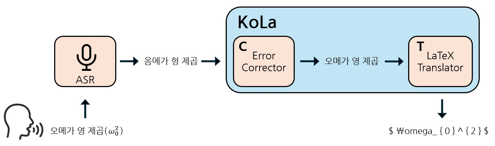

# KoLa: Korean speech to LaTeX extraction Using small LM Modules

📢 2025년 1학 [AIKU](https://github.com/AIKU-Official) 활동으로 진행한 프로젝트입니다
🎉 2025년 1학기 AIKU Conference 열심히상 수상!

## 소개

We introduce KoLa, a lightweight, modular pipeline designed to translate Korean mathematical speech directly into LaTeX expressions. Central to our contribution is KoTeX-100K, KoTeX-400K a newly constructed dataset containing 100,000 aligned triples of Korean mathematical speech audio, textual transcriptions, and corresponding \LaTeX formulas. 

## 방법론

KoLa utilizes a Whisper-based ASR module followed sequentially by two compact modules: a text-based Error Corrector and a LaTeX Translator. Both modules are independently trained on KoTeX 100K, KoTeX 400K enabling robust correction of ASR errors and flexible improvement of formula transcription quality. Our findings demonstrate the feasibility of high-quality mathematical speech transcription in Korean, highlighting opportunities for extending this approach to multilingual mathematical speech understanding. We publicly release our code and dataset to facilitate further research.

## 환경 설정

(Requirements, Anaconda, Docker 등 프로젝트를 사용하는데에 필요한 요구 사항을 나열해주세요)

## 사용 방법

(프로젝트 실행 방법 (명령어 등)을 적어주세요.)

## 예시 결과

- 한국어 음성을 받고, 대응되는 LaTeX를 출력합니다.

- 예시 input: 에이제곱 더하기 비제곱
- 예시 output:
$$
\frac{a^2 + b^2}
$$

## 팀원

- [김민준](ddomjun): build, train, test KoLa model pipeline code
- [전혜서](doupari): data generation, data pre-/post-processing, evaluation on other LLM models
- [김태관](TTKKWAN): build, train, test KoLa model pipeline code
- [윤승현](xiseren): data generation, data pre-/post-processing
